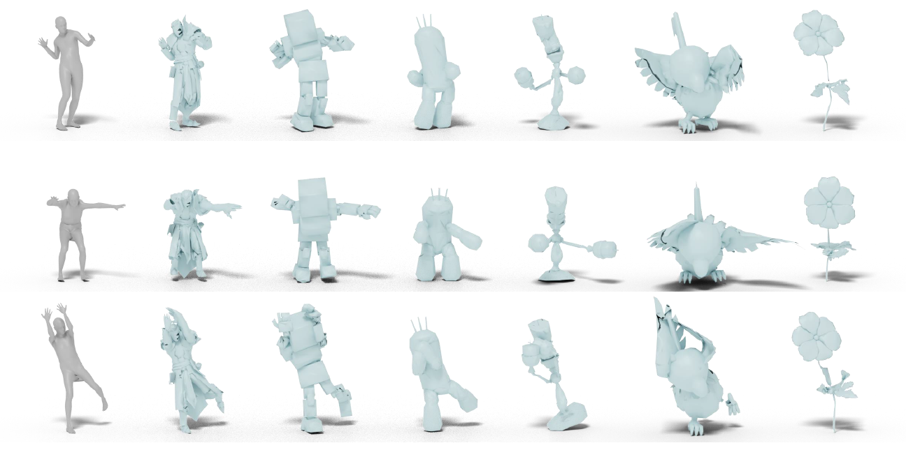

# Skeleton-free Pose Transfer for Stylized 3D Characters


This is the official repository for ECCV 2022 paper _Skeleton-free Pose Transfer for Stylized 3D Characters_.  

[\[Paper\]](https://zycliao.com/sfpt/sfpt.pdf) [\[Project page\]](https://zycliao.com/sfpt)  

More detailed documentation coming soon!

## Prerequisites
- Python >= 3.7
- [Pytorch](https://pytorch.org/) >= 1.4
- [Pytorch-geometric](https://pytorch-geometric.readthedocs.io/en/latest/notes/installation.html)
- [Pymesh](https://pymesh.readthedocs.io/en/latest/installation.html) (optional)

```
pip install opencv-python tensorboardx smplx pyrender open3d cython kornia
```

## Demo
Download our demo data and pretrained model from [here](https://drive.google.com/file/d/1k0Vg1N6xlLoPGG3Lrpa5Ly5ThLEqAmUg/view?usp=sharing).
Unzip it to the project root directory.

Then,
```
python demo.py
```

Checkt the results in `./demo/results` and they should be the same as meshes in `./demo/results_reference`.  

To try with your own data, make sure the number of triangles is around 5K (not a strict requirement) and the orientation of the character is the same as demo data (front: +Z, up: +Y)

## Training

More documentations about training will come soon.

### Data Preparation
All paths are defined in `global_var.py`
#### Mixamo
1. Download [Mixamo characters](https://www.mixamo.com/#/?page=1&type=Character) of T-pose. 
2. Download [Mixamo animations](https://www.mixamo.com/#/?page=1&type=Motion%2CMotionPack). Note that we don't use character-specific animations. 
   Thus, simply download animations for one character.
3. Convert static characters (T-pose) into `.obj` format and animations into `.bvh` format.
   Unfortunately, I used some internal codes for this part, which cannot be open-sourced.
   You might have to write the conversion yourself.
4. Put characters of T-pose in `{MIXAMO_PATH}/obj` in `.obj` format. 
5. Put ground truth skinning information of characters in `{MIXAMO_PATH}/rig_info`.
   The data format should be the same as in `rig_info` in [RigNet dataset](https://github.com/zhan-xu/RigNet). 
6. Run `python data_proc/mixamo_simplify.py` to make sure the triangle numbers are less than 5000.  
7. Run `python data_proc/mixamo_preproc_simplify.py`
8. Run `python data_proc/mixamo_motion_preproc.py`

### Run Training

```
python train.py
```


## Citation
Please cite our paper if you use this repository:
```
@inproceedings{liao2022pose,
    title = {Skeleton-free Pose Transfer for Stylized 3D Characters},
    author = {Liao, Zhouyingcheng and Yang, Jimei and Saito, Jun and Pons-Moll, Gerard and Zhou, Yang},
    booktitle = {European Conference on Computer Vision ({ECCV})},
    month = {October},
    organization = {{Springer}},
    year = {2022},
}
```

## Credit
We borrowed part of the codes from the following projects:  

https://github.com/zycliao/TailorNet_dataset  
https://github.com/zhan-xu/RigNet  
https://github.com/YadiraF/face3d  
https://github.com/kzhou23/shape_pose_disent  

